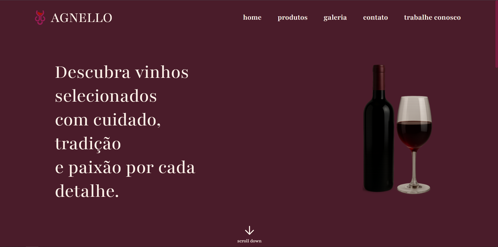
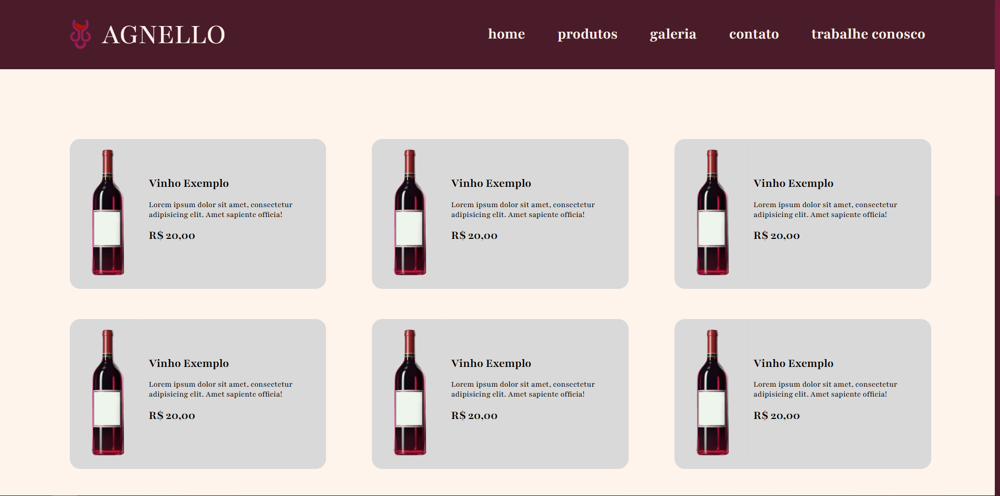
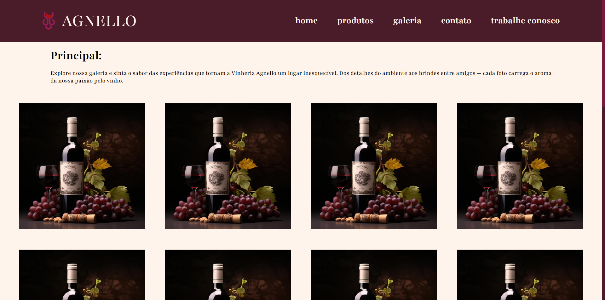
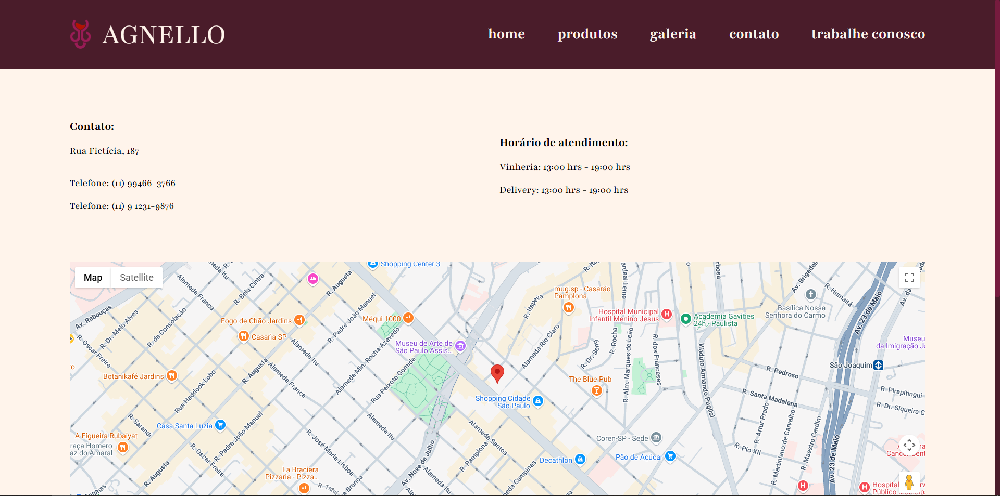
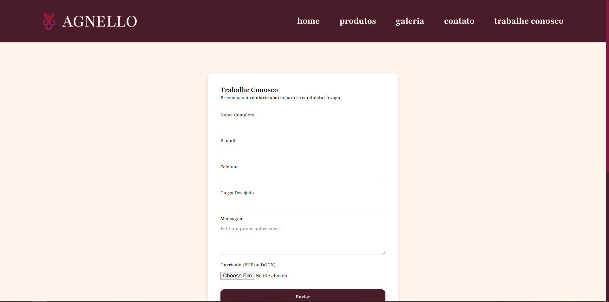

<h1 align=center>Vinheria Agnello 🍷</h1>
A Vinheria Agnello iniciou suas atividades em São Paulo há mais de 15 anos, contando com apenas uma loja física onde coloca à disposição do mercado uma vasta gama de rótulos de vinícolas nacionais e internacionais. Com uma gestão tradicional e conservadora, o Sr. Giulio, proprietário da vinheria, resistiu por muito tempo à ideia de entrar no mundo do e-commerce, por julgar esse um meio um tanto “frio”, distante do cliente, e, portanto, não adequado para o padrão de atendimento que gosta de oferecer em sua loja. 

No entanto, agora, para buscar minimizar o impacto negativo da pandemia em seus negócios, Giulio resolveu seguir os conselhos de sua filha Bianca e está disposto a contratar o desenvolvimento de um portal de e-commerce.

## 🔴 Problema
Em decorrência da pandemia, seu movimento sofreu um impacto significativo, dadas as restrições de mobilidade de seus compradores que se viram impedidos de frequentar a loja física e muitos acabaram migrando para lojas online.  

## 🏁 Solução
Na realidade, as únicas certezas percebidas são o fato de que os proprietários querem o desenvolvimento de uma solução de e-commerce e o desejo de que seja um portal que propicie ao usuário uma experiência próxima àquela encontrada na loja física.

Para esta primeira etapa, a solução para o problema do Sr. Giulio será a criação de um site estático contendo apenas informativos sobre:
* Home
* Produtos
* Galeria
* Trabalhe Conosco
* Contato

## 🔗 Como acessar o site
O site atualmente só pode ser visto utilizando a integração do **Github Pages**, seguindo este link: https://espv1.github.io/cp-1-frontend-design-vinheria-agnello/ .Fique à vontade para clonar o repositório ou fazer um fork e analisar mais detalhes utilizando a integração do *Live Server* (Visual Studio Code).

## 🧰 Tecnologias Utilizadas
* Linguagem de Marcação: HTML5
* Linguagem de Estilização: CSS3
* IDE: Visual Studio Code
* Software de Versionamento: GIT
* Software de Design de Telas: Figma

## 📄 Páginas
## Home

*Página inicial da vinheria contendo informações básicas sobre vinhos e com links de redirecionamento para outras partes do site.*

## Produtos

*Página de Produtos com foco em mostrar os produtos que a loja possui, porém sem nenhuma interação além de cards com nome e detalhes do produto.*

## Galeria

*Página de Galeria contendo vídeos e fotos sobre a vinícola e vinhos.*

## Contato

*Página de Contato contendo horário de atendimento e meios de contato com a loja.*

## Trabalhe Conosco

*Página de Trabalhe Conosco com informações sobre o interesse da vaga e um formulário não funcional para ser preenchido com informações do interessado.*

## 🧑‍💻 Equipe
<table>
  <tr><th>Integrantes</th><th>Tarefas</th></tr>
  <tr>
    <td align = "center">
      
<a href = "https://github.com/AdrianSouz">Adrian de Souza</a>
<b>RM:562959</b>
    </td>
    <td>
      <ul>
        <li>Design das telas no Figma</li>
        <li>Criar e estilizar página "Trabalhe Conosco"</li>
      </ul>
    </td>
  </tr>
    <tr>
    <td align = "center">
      
<a href = "https://github.com/dev-camila">Camila Martins</a>
<b>RM:561492</b>
    </td>
    <td>
      <ul>
        <li>Criar e estilizar a página "Galeria"</li>
        <li>Revisão ortográfica dos textos</li>
      </ul>
    </td>
  </tr>
    <tr>
    <td align = "center">
      
<a href = "https://github.com/gabrielamara98">Gabriel Amara</a>
<b>RM:561403</b>
    </td>
    <td>
      <ul>
        <li>Gestão do README e repositório</li>
        <li>Criar e estilizar página "Produtos" </li>
      </ul>
    </td>
  </tr>
    <tr>
    <td align = "center">
      
<a href = "https://github.com/luararamos">Luara Ramos</a>
<b>RM:565573</b>
    </td>
    <td>
      <ul>
        <li>Criar e estilizar página "Contato"</li>
        <li>Revisão ortográfica dos textos</li>
      </ul>
    </td>
  </tr>
    <tr>
    <td align = "center">
      
<a href = "https://github.com/pedroviscz">Pedro Lucas Almeida</a>
<b>RM:566256</b>
    </td>
    <td>
      <ul>
        <li>Design das telas no Figma</li>
        <li>Criar e estilizar a página "Inicio"</li>
        <li>Criar e estilizar Header e Footer</li>
      </ul>
    </td>
  </tr>
</table>

## Notas
Projeto: Case-Vinheria Agnello

Repositório que servirá como 1º Checkpoint da disciplina de Front-End da FIAP

Professor avaliador: Lucas Silva de Sousa

Regras de proteção para a branch main localizada em RuleSets
